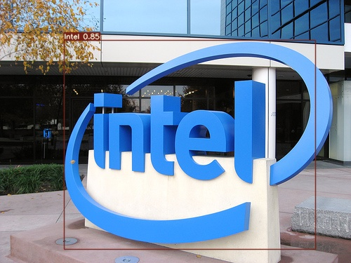

# Logo Detection - YOLO
<a name="readme-top"></a>

<!-- ABOUT THE PROJECT -->
## Introduction
Object detection is a computer vision technique that allows us to identify and locate objects in an image or video. With this kind of identification and localization, object detection can be used to count objects in a scene and determine and track their precise locations while accurately labeling them. Object detection is commonly confused with image recognition, so before we proceed, it's important that we clarify the distinctions between them. Image recognition assigns a label to an image. A picture of a dog receives the label "dog". A picture of two dogs still receives the label "dog". Object detection, on the other hand, draws a box around each dog and labels the box "dog". The model predicts where each object is and what label should be applied.
The purpose of this project is training a logo detection model with YOLO using two different datasets. It can detect logos in the wild images.



<!-- ARCHITECTURE -->
## Architecture
This project supports two YOLO architectures:

### YOLOv7
YOLOv7 surpasses all known object detectors in both speed and accuracy in the range from 5 FPS to 160 FPS and has the highest accuracy 56.8% AP among all known real-time object detectors with 30 FPS or higher on GPU V100.

### YOLOv11 (NEW)
Ultralytics YOLOv11 is a cutting-edge, state-of-the-art (SOTA) model that builds upon the success of previous YOLO versions and introduces new features and improvements to further boost performance and flexibility. YOLOv11 is designed to be fast, accurate, and easy to use, with significant improvements in architecture and training methods.

YOLO architectures generally have three main components:
* Backbone - extracts essential features from an image
* Neck - collects feature maps and creates feature pyramids
* Head - consists of output layers for final detections

For detailed information about YOLOv7, see this [paper][1].
<p align="right">(<a href="#readme-top">Back to Top</a>)</p>

<!-- DATASET -->
## Dataset
We have two datasets in this work. One is smaller than the other. The small one is called **Flickr Logos 27**. he training set contains 810 annotated images, corresponding to 27 logo classes/brands (30 images for each class). All images are annotated with bounding boxes of the logo instances in the image.

The brands included in the dataset are Adidas, Apple, BMW, Citroen, Coca Cola, DHL, Fedex, Ferrari, Ford, Google, Heineken, HP, McDonalds, Mini, Nbc, Nike, Pepsi, Porsche, Puma, Red Bull, Sprite, Starbucks, Intel, Texaco, Unisef, Vodafone and Yahoo.

To see the details of the Flickr Logos 27 dataset, please visit this [page][2].

The other dataset is **LogoDet-3K**. LogoDet-3K is the largest logo detection dataset with full annotation, which has 3,000 logo categories, about 200,000 manually annotated logo objects, and 158,652 images. To see which brands are included, please visit this [page][3].

The model is trained using Flickr Logos 27 because LogoDet-3K training would take too much time. However, this project is ready to be trained with LogoDet-3K. The steps to use LogoDet-3K will be added soon.
<p align="right">(<a href="#readme-top">Back to Top</a>)</p>

<!-- GETTING STARTED -->
## Getting Started
Instructions on setting up your project locally.
To get a local copy up and running follow these simple steps.

### Download dataset
To download the dataset, run **getFlickr.sh**.
  ```sh
  sh getFlickr.sh
  ```
It will be downloaded inside to **data** folder.

### Download base models

#### For YOLOv7:
You can download the base models by visiting the links below:
* [yolov7_training.pt][4]
* [yolov7-tiny.pt][5]
* [yolov7-e6e_training.pt][7]

#### For YOLOv11:
YOLOv11 models will be automatically downloaded when needed through the Ultralytics package, but you can also download them manually from the [Ultralytics GitHub repository][8].

### Get submodules
Install submodules
  ```sh
  git submodule update --init
  ```

### Install dependencies
To install the required packages. In a terminal, type:
  ```sh
  pip install -r src/requirements.txt
  ```

### Convert the annotations
Now that we have our dataset, we need to convert the annotations into the format expected by YOLO. YOLO expects data to be organized in a specific way, otherwise it is unable to parse through the directories.
  ```sh
  python src/convert_annotations.py --dataset flickr27
  ```
To see if the conversion is correct, run.
  ```sh
  python src/convert_annotations.py --dataset flickr27 --plot
  ```

### Partition the Dataset
Next, we need to partition the dataset into train, validation, and test sets. These will contain 80%, 10%, and 10% of the data, respectively.
  ```sh
  python src/prepare_data.py --dataset flickr27
  ```

### Training

#### YOLOv7 Training
The training specifications are:
* Epoch: 300
* Dataset: Flickr Logos 27
* Batch size: 2
* Image size: 640
* GPU: NVIDIA GeForce RTX 3060 Laptop GPU

If you are having fitting the model into the memory:
* Use a smaller batch size.
* Use a smaller network: the yolov7-tiny.pt checkpoint will run at lower cost than the basic yolov7_training.pt.
* Use a smaller image size: the size of the image corresponds directly to expense during training. Reduce the images from 640 to 320 to significantly cut cost at the expense of losing prediction accuracy.

To start the training:
  ```sh
  python src/yolov7/train.py --img-size 640 --cfg src/cfg/training/yolov7.yaml --hyp data/hyp.scratch.yaml --batch 2 --epoch 300 --data data/logo_data_flickr.yaml --weights src/yolov7_training.pt --workers 2 --name yolo_logo_det --device 0
  ```

#### YOLOv11 Training (NEW)
The YOLOv11 training can be done using the new training script:

  ```sh
  python src/train_yolo11.py --dataset flickr27 --img-size 640 --batch 16 --epochs 300 --model yolo11n.pt --workers 8 --device 0 --name yolo11_logo_det
  ```

You can also use the Jupyter notebook for a more interactive experience:
  ```sh
  jupyter notebook src/train_yolo11.ipynb
  ```

### Inference

#### YOLOv7 Inference
To test the YOLOv7 training model:
  ```sh
  python src/yolov7/detect.py --source data/Sample/test --weights runs/train/yolo_logo_det/weights/best.pt --conf 0.25 --name yolo_logo_det
  ```

#### YOLOv11 Inference (NEW)
To test the YOLOv11 training model:
  ```sh
  python src/predict_yolo11.py --weights runs/detect/yolo11_logo_det/weights/best.pt --source data/Sample/test --conf-thres 0.25 --name yolo11_logo_det
  ```

You can also use the Ultralytics YOLO directly:
  ```sh
  yolo predict model=runs/detect/yolo11_logo_det/weights/best.pt source=data/Sample/test conf=0.25 name=yolo11_logo_det
  ```
<p align="right">(<a href="#readme-top">Back to Top</a>)</p>

<!-- RESULTS -->
## Results

### YOLOv7 Results
Download the resulting YOLOv7 model [here][6].

Confusion Matrix:


PR Curve:


### YOLOv11 Results
Results will be available once training has been completed.

[1]: https://arxiv.org/pdf/2207.02696.pdf
[2]: http://image.ntua.gr/iva/datasets/flickr_logos/
[3]: https://arxiv.org/pdf/2008.05359.pdf
[4]: https://drive.google.com/file/d/1Uch80u6CVGQK4EfxvDtae4DhbgdyOUZH/view?usp=share_link
[5]: https://drive.google.com/file/d/1flQiEhQ4bfYwntRFCz0mw-wbKL0fDrsJ/view?usp=share_link
[6]: https://drive.google.com/file/d/1tTjodl4IbJChQizY7pL5M1lXwXSiImS4/view?usp=share_link
[7]: https://github.com/WongKinYiu/yolov7/releases/download/v0.1/yolov7-e6e_training.pt
[8]: https://github.com/ultralytics/ultralytics


